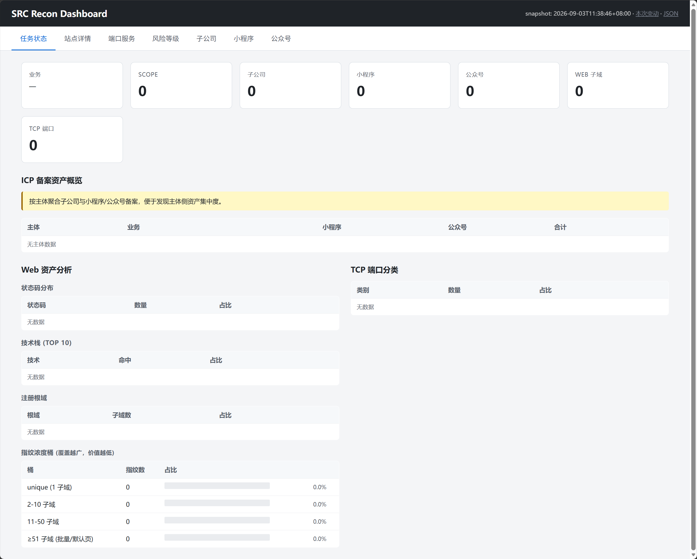

# recon — SRC 资产测绘与监控流水线

> 企业资产采集 → 主动测绘 → 每日增量监控 → 本地可视化的端到端 SRC 工具链

<p align="left">
  <a href="./LICENSE"></a>
  <a href="./NOTICE"></a>
  
  
  
</p>

**srcradar** 是一站式 SRC 资产测绘与监控流水线：**业务名 → 法律实体图谱 → 主动测绘 → 每日增量 diff → 本地 dashboard**。其核心组成:

| 角色 | 模块 | 性质 |
|---|---|---|
| **主干** | `pdtm`（主动测绘 4 阶段编排）+ `daily`（cron + 快照 diff + 本地 dashboard）+ `manage`（业务录入） | 默认安装、自动运行 |
| **可选 plugin** | `db_align`（enscan，企业图谱，标 LOCKED tag）+ `ymicp`（小程序 / 公众号备案反查） | 自部署、自启用 |
| **共享数据** | 单 SQLite (`db/recon.sqlite3`) 串联所有产出 |

可选用 plugin 的安装 / 使用 / 运维 详见各自 README：[`db_align/README.md`](./db_align/README.md) · [`ymicp/README.md`](./ymicp/README.md)。**仅供合法授权场景使用**（详见 §零）。本工具**只做信息收集**，不涉及漏洞利用。

---

## 使用前提（必读）

本工具**仅供持有合法书面授权的用户**使用，合规授权包括但不限于：

- **SRC（安全响应中心）合作协议**
- **渗透测试授权**（合同 / PDF 留档）
- **资产白名单**（自有资产 / 已签托管协议 / 测试域名）

srcradar 仅提供**技术实现**，**不参与、不背书、不知情**任何具体使用场景。

**运营者承担全部合规责任**。包括但不限于：目标单位授权、跨境数据传输合规（个保法 PIPL / 数据出境安全评估）、`爱企查/天眼查/七麦` 等数据源 ToS 遵守。

完整法律条款见 [`LICENSE`](./LICENSE)（Apache-2.0）+ [`TERMS_ADDENDUM.md`](./TERMS_ADDENDUM.md)（附加使用限制与免责声明）+ [`NOTICE`](./NOTICE)（上游致谢）+ [`ymicp/README.md`](./ymicp/README.md) §声明（ymicp 模块专属告知）。

> **工具定位**：srcradar 是**信息收集**工具（子域枚举 / DNS 解析 / 端口探测 / HTTP 探测 / URL 资产扫描），**不涉及漏洞利用或 PoC 触发**。如需漏洞验证，请使用专门的漏洞扫描工具。

---

## Quick start

```bash
# 1. 检查环境(只查不装):
#    需要 go>=1.25, python3>=3.12, git>=2.0
./check.sh

# 2. 装所有上游依赖(pdtm -> PD 工具 -> cdnmatch -> 自动 init-db;
#    默认安装 pdtm + PD 工具 + cdnmatch;
#    db_align (enscan) 与 ymicp 由 install.sh 单独引导,详见各自 README):
./install.sh --no-enscan

# 3. (可选) 如需 enscan 插件,详见 [db_align/README.md](./db_align/README.md) §安装
#    (标 LOCKED tag,需人工授权;运行时半自动介入 — cookie 失效自愈 / 缓存清理,
#     见 [db_align/README.md](./db_align/README.md) §运维)

# 4. (可选) 如需小程序备案反查 plugin,详见 [ymicp/README.md](./ymicp/README.md) §部署
```

> **入口约定**:`check.sh` 与 `install.sh` 是 2026-09 重构后的入口;老 `init.sh` 仅保留 `--init-db` / `--check-schema` 两个独立工具入口(详见 [§五](#五快速开始))。

> **新 shell 必跑**:`pdtm` 与 PD 工具装到 `~/go/bin/` 与 `~/.pdtm/go/bin/`,**不会**自动进当前 shell 的 PATH;新开的 shell 需要手动 `source ~/.bashrc` 或 `source ~/.zshrc`(按你的 shell 选),或者在脚本里 `export PATH="$PATH:$HOME/go/bin:$HOME/.pdtm/go/bin"` 才能直接 `pdtm` / `dnsx` 不报 not found。

> **装到哪**:pdtm 装到 `~/go/bin/`;PD 工具链(dnsx/httpx/subfinder/alterx/naabu/cdncheck 等)由 pdtm 管理在 `~/.pdtm/go/bin/`;cdnmatch 在 `pdtm/bin/`;空 DB `db/recon.sqlite3` 由 install.sh 末尾自动建。详见 [`install.sh`](install.sh) 头部注释。

> **运行要求**:srcradar 的主动扫描能力依赖 `install.sh` 自动装的外部工具(`httpx`、`dnsx`、`naabu`、`subfinder`、`alterx`、`cdncheck`)。这些工具不随仓库分发,需要先跑 `./check.sh` + `./install.sh`。详见 §五末尾工具列表与 §三-上游致谢。

---

## 一、项目目标

为 SRC(安全响应中心)运营场景,把「业务名 → 法律实体图谱 → 主动测绘资产 → 每日增量监控」做成一条流水线:

- **数据契约**:所有产出沉淀在一个共享的 SQLite(`db/recon.sqlite3`),按业务名隔离
- **运维契约**:每天 03:00 北京时间自动跑一轮,产出增量报告 + 本地可视化 dashboard
- **协作契约**:不抢上游(`ENScan_GO`)、不抢下游(其它 recon 工具),只做连接与编排

---

## 二、架构概览

```
   ┌─────────────────┐
   │   business name │       e.g. "ExampleCo"
   └────────┬────────┘
            ▼
   ┌──────────────────────┐         ┌──────────────────────────┐
   │   db_align (Go)      │────────►│  ENScan_GO (上游子进程)   │
   │ resolver→crawler     │         │  爱企查/天眼查/七麦        │
   │       →store         │         └──────────────────────────┘
   └──────────┬───────────┘
              ▼
   ┌──────────────────────────────────────┐
   │  db/recon.sqlite3  (WAL, 共享)        │
   │  businesses · companies · mapp_records│
   │  scopes · web_subdomains · tcp_assets│
   └──────────────┬───────────────────────┘
                  ▼
   ┌───────────────────────┐    ┌──────────────────────────┐
   │  pdtm (shell+py)      │    │  ymicp (Python)          │
   │  主动测绘 4 阶段:       │    │  小程序/公众号备案回查    │
   │  subfinder→alterx→    │    │  -b 业务模式批量          │
   │  dnsx→naabu→httpx     │    │                          │
   │  →import_scan_results │    │  ⭐ 用户自部署,srcradar   │
   │                       │    │    仅提供客户端            │
   └──────────┬────────────┘    └──────────┬───────────────┘
              ▼                            ▼
   ┌─────────────────────────────────────────────────────────┐
   │                daily/  (cron + Python)                   │
   │  snapshot.py → diff.py → reports/<run-id>/ + dashboard  │
   └─────────────────────────────────────────────────────────┘
```

<br>

<p align="center">
  
</p>

<p align="center">
  <em>Dashboard 总览（127.0.0.1:8765，7 个核心 tab：任务状态 / 站点详情 / 端口服务 / 风险等级 / 子公司 / 小程序 / 公众号）</em>
</p>

<br>

**关键不变量**

- 各模块按**业务名**解耦,1:N 的 `businesses.id` → `companies.business_id` 是隔离边界
- `db_align` 不写 `web_subdomains` / `tcp_assets` / `permutation_state`,那是 pdtm 的领地
- pdtm 不写 `mapp_records`,那是 `db_align` + ymicp 的领地
- `daily/` 只读 DB + 拍快照,永不动业务表

---

## 三、模块速查

| 模块 | 角色 | 详情 |
|---|---|---|
| `db_align/` | **enscan plugin（可选用）**：业务名 → 法律图谱 + 资产反查(Go orchestrator) | [README](./db_align/README.md) · [CLAUDE.md](./db_align/CLAUDE.md) |
| `internal/resolver` | AQC 多候选打分,严格模式拒绝弱匹配 | `MinAcceptScore=80`,弱匹配需 `-broad` 或 `-pid` 旁路 |
| `internal/crawler` | 控股树遍历 + 资产 section 反查 | 进程内 `seen[pid]` 环守卫,默认 51% 控股阈值 |
| `internal/store` | SQLite upsert + schema 增量迁移 | 只增 `service_type_map` / 2 index / `companies.group` |
| `internal/permute` | 关键词变体生成 + 数字↔汉字转换 | 单测覆盖 |
| `pdtm/` | 主动测绘 4 阶段编排 | [README](./pdtm/README.md) |
| `pipeline.sh` | 顶层编排 + 自动清理 | `flock` 互斥,失败保留现场可选 |
| `scan.sh` | 子域派生 + 精确/glob 双路 | 无 `*` 走 fast path 直接 dnsx,有 `*` 走 subfinder → alterx → permutation |
| `scanner.sh` | DNS 解析 + CDN 研判 + 端口扫描 | `cdnmatch` 离线研判替代老 cdncheck 阻塞调用;`httpx` / `dnsx` 加 `< /dev/null` 防 stdin hang |
| `cdnmatch/` | Go 包装器(可选):CDN/WAF/Cloud 分类 | 离线网段匹配,需 build,详见 §八-10 |
| 外部依赖 | `httpx` / `dnsx` / `naabu` / `subfinder` / `alterx` 等 | 由用户安装到 PATH(见 §五),srcradar 仅调用 |
| `bin/` | build 产物目录(cdnmatch 可选) | 不随仓库分发,需要用户自行 build |
| `target_glob.py` | `target.txt` → ERE + base 提取 | `(^&#124;\.)` POSIX ERE 合规(原 PCRE 静默 0 命中已修) |
| `import_scan_results.py` | `scan_results/` → 入库 | 按 `response_hash` 去重 |
| `ymicp/` | **集成层 plugin（可选用）**：小程序/公众号备案批量回查 | [README](./ymicp/README.md) |
| `daily/` | cron + 快照 diff + dashboard | [README](./daily/README.md) |
| `daily_monitor.sh` | cron 入口 + 多阶段编排 + 按 config 过滤 | `flock` 互斥;阶段固定序:`enscan → pdtm → icp`;每业务按 `recon_business_config` 过滤 |
| `lib/snapshot.py` | 6 表全量拍快照 JSON | 派生 `host_ip_map` 供 dashboard IP 列回填 |
| `lib/diff.py` | 快照对比 → 增量报告 | added/reactivated/deactivated/changed/deleted |
| `lib/dashboard.py` | 127.0.0.1 只读 Web,4 tab | 任务状态/站点详情/端口服务/风险等级 |
| `ENScan_GO/` | 第三方爱企查客户端,作为子进程 | vendored 源码 + `outs/` xlsx 落盘 |
| `db/recon.sqlite3` | 共享数据,所有模块写入 | WAL + busy_timeout 5s,允许并发读 |

---

## 三点五、上游致谢与 License

本项目的可执行能力由下列上游项目支撑,详见顶部 `LICENSE`(Apache-2.0)与 [`NOTICE`](./NOTICE) 文件。

### 代码上游（srcradar 直接调用或源码依赖）

| 上游项目 | 角色 | License | 维护关系 |
|---|---|---|---|
| **[mssky9527/ENScan_GO](https://github.com/mssky9527/ENScan_GO)**（原仓库 [wgpsec/ENScan_GO](https://github.com/wgpsec/ENScan_GO) 已迁移）| 企业信息采集（爱企查/天眼查/七麦/风鸟） | **Apache-2.0** | © 2023-2026 keac @ wgpsec |
| **[projectdiscovery/httpx](https://github.com/projectdiscovery/httpx)** | Web 主动探测 | **MIT** | © 2021-2025 ProjectDiscovery, Inc. |
| **[projectdiscovery/dnsx](https://github.com/projectdiscovery/dnsx)** | DNS 批量解析 | **MIT** | © 2021-2025 ProjectDiscovery, Inc. |
| **projectdiscovery/cdncheck**（被 [`pdtm/cdnmatch`](./pdtm/cdnmatch/) import，未修改源码）| CDN/WAF 离线分类 | **MIT** | © 2021-2025 ProjectDiscovery, Inc. |
| **modernc.org/sqlite**（`db_align` 依赖）| 纯 Go SQLite 驱动 | **BSD-3-Clause** | © modernc.org/sqlite authors |

### 包管理与外部依赖（pdtm 装的工具集 + 推荐装工具）

| 工具 | 上游 | License | 维护关系 |
|---|---|---|---|
| **[pdtm](https://github.com/projectdiscovery/pdtm)** | 包管理器（装 PD 工具链） | **MIT** | © 2021-2025 ProjectDiscovery, Inc. |
| **[subfinder](https://github.com/projectdiscovery/subfinder)** | 子域枚举 | **MIT** | © 2021-2025 ProjectDiscovery, Inc. |
| **[alterx](https://github.com/projectdiscovery/alterx)** | 关键词派生 | **MIT** | © 2021-2025 ProjectDiscovery, Inc. |
| **[naabu](https://github.com/projectdiscovery/naabu)** | TCP 端口扫描 | **MIT** | © 2021-2025 ProjectDiscovery, Inc. |
| **[ffuf](https://github.com/ffuf/ffuf)** | URL 字典爆破（`pdtm/scan_urls.py`）| **MIT** | © 2021 Joona Hoikkala |
| **[gau](https://github.com/lc/gau)** | wayback / 历史 URL（`pdtm/scan_urls.py`）| **MIT** | © 2025 Corben Leo |
| **[URLFinder](https://github.com/pingc0y/URLFinder)**（中文社区版 by pingc0y）| 主动爬虫（`pdtm/scan_urls.py`）| **MIT** | © 2022 pingc0y |

> **集成模式**:本节列出的工具均通过 `pdtm/scan_urls.py` 等脚本以 `subprocess.run()` 调用,**非源码 fork / import**。`pdtm` 是包管理器,**不是**这些工具的代码上游。
>
> **上游版本锁定**:ENScan_GO_TAG=v1.4.0（见 `install.sh`）。ProjectDiscovery 工具由 `pdtm -ia` 装到 `~/.pdtm/go/bin/`,无锁定（用户自管升级）。

### 第三方服务声明(用户自部署)

| 服务 | 提供方 | License | 维护关系 |
|---|---|---|---|
| **ymicp / ICP_Query** | [HG-ha / 一铭](https://github.com/HG-ha/ICP_Query) | ⚠️ **未声明**(GitHub 默认视为 All rights reserved)| **非 srcradar 维护**,原项目 README 声明仅供学习交流 |

ymicp 是 srcradar `ymicp/` 模块依赖的第三方服务,srcradar **不**重新分发服务端、不主动拉镜像、**不**背书其合规性。详见 [`ymicp/README.md`](./ymicp/README.md) §声明。

---

## 四、共享数据模型

数据库 `db/recon.sqlite3`,WAL 模式 + busy_timeout 5s。

| 表 | 用途 | 写入方 |
|---|---|---|
| `businesses` | SRC 业务字典(`id`, `business_name`) | 任意,按 `business_name` 唯一 |
| `recon_business_config` | 业务级阶段开关(`business_id`, `enabled`, `web`, `tcp`, `icp`) | 手动 SQL;`daily_monitor.sh` 读后按业务过滤 |
| `companies` | 法律实体(`business_id`, `unit_name`, `nature_name`, `main_licence`, `group`) | `db_align` + `ymicp` |
| `mapp_records` | ICP/小程序/App/公众号等备案与轻资产(`company_id`, `service_licence`, `service_type`) | `db_align` + `ymicp` |
| `scopes` | 可测/非可测资产白名单 | **`db_align -scope`** / **`pdtm finalize_scope`** / **`manage/scope_import.sh`**（3 条独立路径，任一即可） |
| `web_subdomains` / `web_hashes` | Web 资产 + 指纹库 | `pdtm/import_scan_results.py` |
| `tcp_assets` | TCP 端口资产 | `pdtm/import_scan_results.py` |
| `permutation_state` | alterx 派生状态缓存(当前 per-entry 30 天冷却;**待改为按周期整表 wipe — 见 §八 #13**) | `pdtm/permutation_cache.py` |
| `service_type_map` | `service_type` 整型 → 人类可读名(自动累积) | `db_align` upsert 时 `INSERT OR IGNORE` |

字段协作契约见各模块 README —— `db_align/README.md` §Caveats / `pdtm/README.md` §DB Schema。

---

## 五、快速开始

```bash
# 1. 准备目录与依赖
cd /opt/srcradar
# Go: db_align (enscan plugin,可选)
# Python: requests
# Shell 工具: dnsx / subfinder / alterx / naabu / httpx / cdncheck

# 2. 装上游依赖(./check.sh 只查;./install.sh 装 pdtm / PD 工具 / cdnmatch)
./check.sh
./install.sh

# 3. (可选) 装 enscan plugin 详见 [db_align/README.md](./db_align/README.md) §安装
#    (可选) 装 ymicp plugin    详见 [ymicp/README.md](./ymicp/README.md) §部署
#    (可选) 加新业务到流水线   `./manage/add_business.sh -n <业务名> [-s seeds/<业务>.tsv] [-i <input_dir>]`
#                              详见 [manage/README.md](./manage/README.md)

# 4. 跑主动测绘
cd pdtm && ./pipeline.sh -b ExampleCo -i /path/to/input/

# 5. 起 dashboard 看结果
cd ../daily && python3 lib/dashboard.py 
# 浏览器经 SSH 隧道访问 http://localhost:8765

# 6. 装 cron(每天 03:00 北京时间,跑 pdtm+icp,业务级开关见 §四 `recon_business_config`)
./install_cron.sh
```

详细 flags / 参数见各模块 README。

> **网络代理**:`db_align` 默认**不**走代理(`-proxy` 默认为空)。如需访问受限网络,通过 `-proxy http://...` 显式传入。详见 [`db_align/README.md`](./db_align/README.md) flag 说明。

## 五半、日常运维跑哪里（命令速查）

> 这一节是**答"装完该怎么用"**。脚本入口级 runbook 见各模块 README,这里只给最常用的几条。

详细文档落在脚本同目录:

- **加业务 / 改业务级开关 / seed TSV** → [`manage/README.md`](./manage/README.md)
- **装 cron / 卸 cron / 单业务手动跑 / 拍快照 / dashboard** → [`daily/README.md`](./daily/README.md)
- **入 scope / 跑全流程 pipeline** → [`pdtm/README.md`](./pdtm/README.md)
- **法律实体反查(db_align) flags** → [`db_align/README.md`](./db_align/README.md)

### 常见任务命令

| 任务 | 命令(从仓库根) |
|---|---|
| 新建业务 + 灌入 scope | `./manage/add_business.sh -n <业务名> [-s seeds/<业务>.tsv] [-i <input_dir>]` |
| 仅入库 scope,不扫 | `(cd pdtm && ./scope_import.sh -b <业务> -i <input_dir> [--dry-run])` |
| 看 / 改业务级开关 | `./manage/set_config.sh -n <业务名> [--enable/--disable/--web 0\|1 --tcp 0\|1 --icp 0\|1]` |
| 跑全流程(自动入 scope + 主动测绘 + 入库) | `(cd pdtm && ./pipeline.sh -b <业务名> -i <input_dir>)` |
| 单业务单次跑(已入库后) | `(cd daily && ./run_one_business.sh -type pdtm,icp <业务名>)` |
| 手动拉控股树 / ICP / 小程序(enscan plugin) | 详见 [`db_align/README.md`](./db_align/README.md) |
| 跑小程序备案反查(ymicp plugin) | 详见 [`ymicp/README.md`](./ymicp/README.md) |
| 装 cron(每天 03:00 北京时间) | `(cd daily && ./install_cron.sh)` |
| 卸 cron | `(cd daily && ./install_cron.sh uninstall)` |
| 看 cron 是否装上 | `crontab -l \| grep daily_monitor` |
| 拍快照(全表导出) | `(cd daily && python3 lib/snapshot.py --out snapshots/db.json)` |
| 起 dashboard(默认 127.0.0.1:8765) | `(cd daily && python3 lib/dashboard.py)` |

### 三个常用 stage 串顺序(pipeline / run_one_business 内部固定)

```
enscan(db_align)  →  pdtm  →  icp(ymicp)  →  daily-url
   ↓                  ↓         ↓                ↓
写 companies /    写 web_sub /  写 mapp_records /   写 web_hash_urls
scopes            tcp_assets
```

任何阶段失败不会阻塞后续阶段——`run_one_business.sh` 返回**位掩码 exit code**:

| bit | 含义 |
|---|---|
| 1 (1) | pdtm 失败 |
| 2 (2) | enscan 失败 |
| 4 (4) | icp 失败 |
| 8 (8) | daily-url 失败 |
| 0 | 全部 OK 或 skipped |

### 业务可跳过 cron(operator 后台控制)

每个业务有 `recon_business_config.enabled` 开关。`--disable` 后该业务**所有阶段**都被 cron + `run_one_business.sh` 跳过,但**仍会拍快照**(用于 diff 监控"未跑期间"的新增)。

```bash
./manage/set_config.sh -n <业务名> --disable        # 暂停
./manage/set_config.sh -n <业务名> --enable         # 恢复
./manage/set_config.sh -n <业务名>                  # 查看当前配置
```

详细语义见 `daily/README.md` §"跳过不想跑的业务"和 §"安装 / 卸载 cron"。

---

## 六、运维硬性约定

源自 `db_align/CLAUDE.md`,所有模块共用:

1. **`ENScan_GO/config.yaml` 绝对不要读** —— 上游凭据文件,即使 echo 一行字段名也不行;`.claudeignore` + `settings.json` 兜底拦截。Claude 也不要从文件名/列表里推断内容
2. **数据源 cookie 失效时**:
   - 关键字:`未登录` / `登录已过期` / `cookie` / `Cookie expired` / `aqc|tyc|rb|qimai 401/403/empty result`
   - 单次判定至少看到 2 处一致信号再认定
   - 追加一行到 `cookie.log`:`<时间戳> [<源>] <原因>; 上次成功 run: <日志文件名>`
   - 后续 run 自动从 `-type` 排除;**所有源都失效 → FATAL 停止**
3. **ENScan 失败清缓存**:`rm -f ../ENScan_GO/enscan.gob`,只在"上次成功 → 这次失败"且无 cookie 信号时清
4. **DB 路径**:所有 `-db` / `--db` 默认指向 `../db/recon.sqlite3`,写之前确认;不要把 `cookie.log` / `logs/*.log` 进版本控制
5. **ProjectDiscovery 工具 stdin 防御**:任何 `dnsx / httpx / naabu / subfinder / cdncheck` 的 shell 调用,只要上游是 `pipeline.sh` / `scan.sh` / `scanner.sh` 这类被外部 `bash script.sh` 调用的脚本,就要加 `< /dev/null`。**ProjectDiscovery 工具 best-effort 关闭 stdin,但在子 shell 中实测会永久 park**(详见 §八-12.2)。cdncheck 仍要 `< /dev/null` 兜底,虽然 `pdtm/scanner.sh` 已改走 `./bin/cdnmatch` 离线路径,不再直调 cdncheck 二进制。

---

## 七、项目总结

经过 2026-07-24 起的多轮 dry-run 与 smoke test,这条流水线在 **ExampleCo** 业务上达到可用状态。

### 数据现状(2026-08-02)

| 维度 | 数量 | 备注 |
|---|---|---|
| `businesses` | 2 | `ExampleCo` / `DemoCorp`(均已写 scope) |
| `companies` | 31 | ExampleCo 手工分组(2/4/10/5) + DemoCorp新增 10 |
| `mapp_records` | 95 | `service_type` 仍 2 个(4/7),§九 列为优先 |
| `scopes` | 8 | 可测 6 / 非可测 2,均 `is_wildcard=1`(命中 wildcard 解析) |
| `web_subdomains` | 74,168 | 持续增长,~215 条单字符噪声(§八-1)待修 |
| `tcp_assets` | 488 | |
| `permutation_state` | 40,592 | alterx 派生缓存,2026-07-28 后从 172 暴增(数据正常) |
| `recon.sqlite3` 大小 | 87 MB | WAL 模式 |

### 设计亮点

1. **resolver 拒绝静默错误** —— `MinAcceptScore=80`,弱匹配(50/60 分)直接报错要求 `-broad` 或 `-pid` 旁路,避免 SRC 绑到集团母公司
2. **schema 协作的克制** —— 只增 `service_type_map` / 2 index / `companies.group`;其余表视为只读,合并入更大平台时不会撞冲突
3. **mapp_records 合成 licence 补丁** —— APP/微信/微博 section 无 ICP 备案号,用 `synth:<company_id>:<service_type>:<service_name>` 占位;确定性 → 重跑 upsert 不重复;逻辑身份仍按 `(company_id, service_name, service_type)`
4. **alterx 派生缓存的"事实子域不进 permutation_state"修复** —— `comm -23` 去重后,subfinder 发现的事实子域每次跑重新喂入,缓存只存真正的派生候选(已用 5 个已知子域 + 149→287 增量验证)
5. **fail-soft 的多阶段编排** —— `run_one_business.sh` 用 3 位 bit-mask 报结果;`flock` 互斥;snapshot before/after 任一失败 → `previous.json` 不轮换,下次还能有 baseline
6. **dashboard 的"本地启发式 + 零外调"** —— 端口风险字典 + 指纹浓度桶 ≥51 标红 + 中文优先重排;严格只绑 127.0.0.1,改 0.0.0.0 启动时 WARN
7. **snapshot/diff 字段口径清晰** —— 时间戳(`fetched_at` / `last_seen` / `updated_at` 等)不算 changed;`web_subdomains` 逻辑键用 `(business_id, subdomain, port)` 而非漂移的 `hash_id`
8. **运维契约下沉到 `CLAUDE.md`** —— 不依赖 README 记忆 cookie/proxy/缓存失效规则,所有"必须做"集中硬性声明;`README.md` 与 `CLAUDE.md` 冲突时以 CLAUDE.md 为准

### 已知能力边界(故意不做)

- **AQC 无向上穿透** —— `branch` 是唯一可靠的向下信号;`invest` / `holds` 多为 null;`partner` 是自然人。跑 `db_align -n DemoCorp` 不会自动走到 DemoCorp 集团下的兄弟子公司。这是 AQC 限制,不是工具 bug(详见 `db_align/README.md` §Design notes)
- **mapp_records.service_licence UNIQUE + 非空约束** —— 由 ymicp schema 定义,db_align 用合成 licence 兼容,本质是上游契约不可改
- **树爬的 `seen` 是进程内** —— 重启 runner 会重新从 seed 走,对长跑批任务成本高;按 README 提示未来应把 seen 持久化到 DB

---

## 八、已知问题

按"已定位/已缓解/未根治"三档排列:

### 1. 单字符 subdomain / Wildcard DNS 噪声 ⏳ 治标未治本

**现象**:`daily/lib/dashboard.py`「站点详情」tab 出现 N 行形如 `http://a/` / `http://j/` / `http://0/` 的条目,URL 无法访问。

**根因**(三层):

1. `pdtm/check_wildcard.sh` 检测到 `*.example.com` 有泛解析,但单字符 permutation 候选没在 HTTP 探测前被剔除
2. httpx 探测时 DNS 被 wildcard 收口到 CDN IP,HTTP 请求落到真实域名(如 `aliondemandfiles.example.com` )的服务器
3. `pdtm/import_scan_results.py` 存库时只保留输入前缀 `a` 作为 `subdomain`,没把真实命中域名写到 canonical 字段

**实测**:`215 条 → 72 个 hash → 6 个 IP(全是 wildcard CDN 收口)`,`response_hash` 是占位符 `<status_code>|<content_length>` 不是真指纹。

**当前缓解**:`lib/dashboard.py:_build_sites` 第一行过滤 `if '.' in subdomain` —— 215 条 no-dot 全部从显示剔除;sites-table 从 46,911 行 → 179 行;gzip 后页面 45.8 KB(之前 25 MB)。

**治本**(待办,`pdtm/README.md` / `daily/README.md` 已给方案但**未合入**):

- 方案 1(推荐):`pdtm/permutation_cache.py` filter 阶段丢单字符 permutation —— 直接不探测,每天少 200+ 次 httpx 请求(实测单字符扫描耗时几分钟)
- 方案 2:`pdtm/import_scan_results.py` 检测 wildcard redirect 后写真实命中域名 —— 保留数据但替换为 canonical 名字

**判断有没有意义**:

| 用途 | 价值 |
|---|---|
| 真实资产盘点 | ❌ 215 条 ≠ 215 站点,真相是 6 个 CDN IP |
| 监控内容变化 | ❌ 占位符 hash,无 diff 价值 |
| 检测 wildcard DNS 状态 | ✅ 这些条目本身就是泛解析开启的证据 |
| 历史趋势 | ❌ 同批次产生,重跑还是同样的 215 条 |

### 2. ENScan_GO 目录整洁度 🟡 待清理

- **`code.bak.20260724_140043/`** 与 **`code/`** 并存,旧版本无保留价值,应删
- **`outs/`** 平铺 50+ xlsx 扫描结果,**无 .gitignore 保护**,文件名字段直接含公司名,潜在凭据泄露风险
- 建议:`code.bak.*` 删除;`outs/` 按 `<业务>/<日期>/<类型>.xlsx` 重归档;加 `.gitignore` 至少拦下 `outs/*.xlsx` 和 `*.bak.*`

### 3. service_type_map 残缺 🔴 跨业务对比受限

`service_type_map` 只有 2 行(`type_4`, `type_7`),`mapp_records` 跨业务对比时无人类可读名。README 自承"占位符待 AQC 真实 `icpinfoAjax` 映射确认",生产用之前需要补完整映射(典型值:4=ICP、7=小程序、5=App、8=公众号 等)。

### 4. 单业务单点验证 ⚠️ 规模未验证

`businesses` 表只有 1 行,所有设计只在 21 家公司 / 41 条备案上验证过:

- 并发跑 N 个业务时的 `flock` 互斥、ENScan 子进程并发、AQC 配额争抢都没经过压力测试
- snapshot 拍全库 6 表 ~50k 行的耗时与内存峰值未测
- **建议**:加第 2 个业务(最简单的 `scanme` 类)做并行验证

### 5. pdtm 已有修复未合入 🟡 文档在代码不在

`pdtm/README.md` 附录 A/B/C 给出了三档"每次跑都大概率找到新资产"的方案 + stage 5/6 fusion 链路 bug 修复,均**有验证数据但未合并**:

- 附录 A:alterx 缓存 bug(`cat ALIVE_FILTERED >> ALTERX_OUT` 导致事实子域被永久冻住)
- 附录 B 方案 A:时间戳词表(必做,改造成本 1 函数 + 1 行调用)
- 附录 B 方案 B:概率性复活采样(改造成本 ~5 行)
- 附录 C:阶段 6 mapper 走 JSONL 而非 `cut -d':' -f1` 文本解析(避免阶段 5 加回 `-title -td` 时再次失效)

### 6. daily/reports 无自动轮转 🟡 长期累积

`daily/reports/` 默认全保留,README 给了手工清理命令但**没装进 cron**。长期跑会无限累积(当前已 7 个目录)。

**建议**:在 `daily_monitor.sh` 入口加一行:

```bash
find "$REPORTS_DIR" -maxdepth 1 -mindepth 1 -mtime +30 -exec rm -rf {} +
```

### 7. 集成测试缺失 🔴 回归靠运气

- `go test ./...` 只覆盖 resolver / permute / scope 单测
- `crawler` 和 `store` 的 upsert 路径只在 smoke test(`-n ExampleCo -all`)里跑过,且依赖 AQC 凭据
- `pdtm` 完全没有自动化测试,所有 fix 都在 README 附录里叙述
- **建议**:基于 sqlite in-memory 给 store / crawler 写集成测试,无需真实 AQC;pdtm 的 fix 合并时同步加回归用例

### 8. 数据库敏感数据未加密 ⚠️ 凭据泄露面

`recon.sqlite3` 43 MB,`mapp_records.raw_json` 存全量 API 响应,`web_subdomains.raw_json` 存 HTTP 响应正文。**未经加密落盘**,任何拿到这台机器的人就能 dump 全部备案 + 服务原始 JSON。`.claudeignore` 拦得住 Claude,**拦不住** shell 用户直接 `cat`。

**建议**:评估 `recon.sqlite3` 静态加密(sqlite SEE / sqlcipher)的必要性,或至少把 `raw_json` 字段移出主库放归档表。

### 9. 文档入口分散 🟢 可读性问题

- `db_align/README.md` 与 `db_align/CLAUDE.md` 内容部分重叠(cookie 失效、proxy)
- `daily/README.md` 500+ 行,`pdtm/README.md` 300+ 行,新读者第一眼看到附录 A/B/C 容易懵
- **建议**:`daily/README.md` 拆 user-guide / design-notes 两份;`pdtm` 附录提一个 `KNOWN_ISSUES.md` 集中管理,本文件作为索引

### 10. cdncheck 阻塞读 stdin 导致流水线永久挂起 ✅ 已根治 (2026-08-01)

**现象**:2026-07-31 的 cron run(`20260731-030002`)从 03:00 一直挂到 14:34 人工介入,共 **11.5 小时**。`ExampleCo` 03:00→06:32 正常完成并入库;`DemoCorp` 06:32 起卡在 `pdtm/scanner.sh:209` 的 cdncheck 域名探测,**7h45m 零进展**。进程 6 个线程全部 park 在 `futex_wait_queue_me` / `ep_poll`,累计 CPU 仅 22 秒。

**根因(两个独立问题叠加)**:

1. **cdncheck 阻塞读 stdin**(主因)。即使已用 `-i <file>` 指定输入,stdin 不是 TTY 时它仍会读 stdin 等 EOF,等不到就永久 park。**结果其实已经算完并写出,进程就是不退出**。
2. **域名模式慢且不可调**(次因)。实测 ~0.9 秒/域名,而 `cdncheck -help` 的 CONFIG 段只有 `-resolver` / `-retry` / `-exclude`,**没有 `-timeout` / `-concurrency` / `-rate-limit`** —— 快不了也兜不住。IP 模式是离线网段匹配,很快,不受影响。

**实测**(v1.2.44):

| 输入规模 | 加 `< /dev/null` | 结果 |
|---|---|---|
| 1 / 5 / 20 / 400 域名 | ❌ | 全部挂死,60s+ 超时,0 输出 |
| 4 域名 | ✅ | **exit=0,2 秒**,3 命中(与挂死前算出的结果一字不差) |
| 50 域名 | ✅ + `-r` 逗号形式 | exit=0,**44 秒**,0 解析错误 |

梯度测试是决定性的:**1 个域名和 27958 个域名挂死表现完全一样**,所以与规模 / 并发 / 限流无关。而 4 域名那次结果在 5 秒内就全部写出,之后干等 85 秒被 timeout 杀掉 —— 证明是"算完但不退出"。

**修复(2026-08-01 合入)**:

新增 `pdtm/cdnmatch/` —— Go 包装器,`import "github.com/projectdiscovery/cdncheck"` 直接调内部的 `Check()`(IP 段 bart trie)和 `CheckSuffix()`(publicsuffix 后缀查),**纯离线,不动 `retryabledns`**。`scanner.sh` 阶段 1+2 重写:

- `dnsx -cname -a -resp -j` 出 JSONL,本来就在跑,加 `-cname` 是顺手(成本几乎 0,因为 dnsx 反正要解析全量域名)。
- `cdnmatch -in DNSX_RAW_FILE -domains pure_domains.txt` 一次性产出 `tmp_domain_{ip,ipv6,cname,ns}_pairs.txt` + `all_unique_ips.txt` + `{cdn,waf,cloud}_{ips,domains}.txt` + `non_cdn_{list,ips}.txt` + `cdnmatch_stats.json`,文件命名和行格式与原 awk pipeline **逐字一致**,所以阶段 3-9 不动。
- 0 次 DNS 查询(原 cdncheck 域名侧 27958 次 query 全部消失),cron 跑 27958 域名的阶段 1+2 从 7h+ 缩到 ~5 秒。

**对照验证**(`pdtm/cdnmatch` smoke test):老 `cdncheck -i ... -cdn -waf` vs 新 `cdnmatch`,同输入 12 IP 输出 4 个 WAF IP `{104.16.132.229, 104.16.133.229, 104.17.207.5, 104.17.208.5}` 完全相同;4 个 CNAME 老/新都命中 2 个 Cloudflare 后缀(`*.cdn.cloudflare.net`)。

**重新启用 cron**:合入已稳定,按 §六 §5 重新 `./install_cron.sh`(无参,跑 pdtm+icp,业务级开关见 §四 `recon_business_config`)。首次观察次日 03:00 报告:阶段 1+2 应在 ~10 秒内完成(`dnsx JSONL: <N> 行` 后紧跟 `[cdnmatch] records=...` 一行),不再看到 `[+] cdncheck` 字样。

**配套变更**:

- `RESOLVERS` 集中在 `scanner.sh` 顶部声明,各调 `-r "$RESOLVERS"`。详见 §八-11。
- `scanner.sh` 移除 `tmp_cdn_ips_detected.txt` 引用(cdnmatch 不再产它)。

**关联风险**:cron 用 `flock -n`,如果新版本再次触发挂起,会是同口径。
**回滚**(如果出问题):
1. `cd pdtm/cdnmatch && rm -rf ../bin/cdnmatch`
2. `git checkout scanner.sh` (回到带 awk + cdncheck 二进制的老版本)
3. 把 §八-10 老"修复方案"段重新兜回硬化层(`< /dev/null` + `-r` CSV + `timeout 600`)

### 11. `-r` 解析器形式跨工具陷阱矩阵 🟡 部分工具静默失效

**陷阱**:不是所有 PD 工具读 `-r file` 或 `-r csv` 都能得到预想行为。**配合 `-silent` 完全看不到报错**,表现为"1 秒跑完但 0 命中"或相似假阳性。

**实测矩阵**(v1.2.44):

| 工具 | `-r ./resolvers`(文件) | `-r 1.2.3.4,5.6.7.8`(CSV) | 调用点 | 选哪种 |
|---|---|---|---|---|
| cdncheck | ❌ 把文件名当主机名解析 → 0 输出 exit=0 | ✅ 正常 | 现在改成 `cdnmatch` 不用二进制了 | CSV |
| dnsx | ✅ 正常 | ✅ 正常 | `scanner.sh`、`scan.sh`、`check_wildcard.sh` | 哪个都行,scanner.sh 取 CSV |
| httpx | ✅ 正常 | ✅ 正常 | `scanner.sh` 阶段 3.5 / 8 | 哪个都行 |
| naabu | ✅ 正常 | ✅ 正常 | `scanner.sh` 阶段 4.5 | 哪个都行 |
| subfinder | ✅ 正常 | ❌ 静默失 0 命中 | `scan.sh` 派生 | **必须文件** |
| alterx | n/a(没 `-r` flag) | n/a | `scan.sh` 派生 | 默认解析 |
| asnmap | ✅ | ✅(无 file 警示语,但实测) | 不在主流水线 | 同 dnsx |

**结论**:

- cdncheck 是唯一在主流水线里被反向坑的工具(已通过 cdnmatch 间接解决)。**新代码不要再直调 `cdncheck` 二进制**;若要 fallback,见 §八-10 的 `cdncheck -cdn -waf` + CSV + `< /dev/null` 三件套。
- subfinder 是反向坑 —— 它写文档说接受 CSV,但**实测 CSV 路径 0 命中**。所以唯一一次 file 调用在 `scan.sh:70`(subfinder);同文件内 dnsx 改用 CSV。
- scanner.sh / check_wildcard.sh 不调 subfinder,统一用 CSV 形式,均从 `pdtm/resolvers` 文件派生。

**统一约定(2026-08-01 起)**:

- **单一事实源 = `pdtm/resolvers` 文件**。改这个文件,所有脚本的 CSV 与 file 视图自动跟随。
- **派生方式**(`scanner.sh` / `scan.sh` / `check_wildcard.sh` 各按需):
  ```bash
  RESOLVERS_FILE="${RESOLVERS_FILE:-resolvers}"   # subfinder 走这条
  RESOLVERS="$(tr '\n' ',' < "$RESOLVERS_FILE" | sed 's/,$//')"   # dnsx/httpx/naabu
  ```
- **每工具取什么**:
  - subfinder → `-r "$RESOLVERS_FILE"`(file,必须)
  - dnsx / httpx / naabu / cdncheck(未来兜底)→ `-r "$RESOLVERS"` 或 `-r "$RESOLVERS_CSV"`(CSV)
- **环境覆写**:`export RESOLVERS_FILE=/path/to/file ./scanner.sh` 一行切换全部。
- **DNS 选型规则**:`pdtm/resolvers` 文件排序原则 = **延迟快 → 慢**(用户按实测 / 业务场景自行排序,具体名单见仓库)。

**`pdtm/resolvers` 文件**:仓库内当前名单由 install.sh 自动维护,请直接查看 `pdtm/resolvers` 文件本身。

### 12. 8 月 2 日合入的修复与新行为(cdncheck 之后的二次体检)

#### 12.1 scan.sh 精确子域快路径(2026-08-02)

`scan.sh` 头部(`[ -s "$TARGET" ]` 之后,glob compile 之前)增加早期检测:扫一次 `target.txt`,若**没有任何 `*` 行**:

```
PRECISE_HOSTS (mktemp) → dnsx → DNSX_OUT → sort -u → exit 0
```

跳过 subfinder / alterx / permutation_cache 全部流程。`pipeline.sh` 下一步调 `scanner.sh`,scanner.sh 从 `DNSX_OUT` 读已解析 host,跑阶段 1(dnsx JSONL,会再做一次 dnsx)+ 2(cdnmatch)+ 5/8(httpx)。

行为分流:

| target.txt | 行为 | 实测耗时 |
|---|---|---|
| `www.scanme.sh`(纯精确) | 仅 dnsx 1 次后 `exit 0` | < 1s |
| `ww*.scanme.sh`(纯 glob) | 走完整 subfinder → alterx → permutation 流程 | 45s(2 IP / 2 web) |
| `*.scanme.sh`(纯 glob) | 同上 | 57s(4 IP / 4 web) |
| `www.scanme.sh\n*.scanme.sh` | 走 glob 流程;精确子域在 PRECISE_HOSTS 双路 | 同 glob |

**业务约定**:精确子域列表 = "不希望扩展范围去查兄弟子域"。如果只关心 `www.scanme.sh` 一台,就别列 `*.scanme.sh`,否则 cron 会去搜 findme/demo/honey/ssl-* 等 5+ 个兄弟域。

#### 12.2 scanner.sh 阶段 5 httpx stdin hang

**根因**:`httpx -l <file>` 已指定输入,但内部仍尝试读 stdin。当 stdin 不是 TTY(在 `pipeline.sh` 调用下)且非 `/dev/null` 时,**GNU httpx 1.10 的某条路径会永久 park**。

**复现**(隔离目录,4 个 scanme.sh IP):

```
scanner.sh standalone        11 秒完成
scanner.sh inside pipeline  600 秒 timeout,0 输出
```

**修复**:`scanner.sh` 三处 `httpx -l ...` 加 `< /dev/null`(阶段 3.5 / 阶段 5 / 阶段 8)。`scan.sh` 内 dnsx 调用也加了 `< /dev/null` 防御。

**理论根因**:ProjectDiscovery 工具(scan 写 stdin 时)是 best-effort 关闭 stdin,某些情况下需要显式 `< /dev/null`。当上游 pipeline 在 `set -euo pipefail` 下用 `bash scanner.sh` 调用时,**子 shell 不会自动关闭 stdin**。

#### 12.3 target_glob.py `(?:...)` PCRE 静默拒绝

`target_glob.py:49` 原输出 `(?:^|\.){escaped}$` —— PCRE 非捕获组语法。但 `grep -E` 是 POSIX ERE,**GNU grep 3.7 静默接受后整体返回 0 命中**(不出错)。

**修复**:`(?:^|\.)` → `(^|\.)`(捕获组,POSIX ERE 合规)。

**影响**:之前生产 cron 跑的所有 glob 路径,阶段 1.5 / 4.5 的 `grep -E -f targets.regex SUBS_TMP` 都是静默失 0 行,然后因为 `set -euo pipefail` 在 `if [...] fi` 体内不触发,空 SUBS_TMP 流到 ALIVE,scan.sh 输出"done -> dnsx_output.txt (0 条)",**实际等于跳过 glob filter**(若上游有 `*.scanme.sh`,alterx 派生候选不会被目标正则过滤直接落盘)。

**这条 bug 的影响范围**:cron 跑了 46k → 74k `web_subdomains`,里面**可能有少量"target 模式外"的子域被错误入库**。参考 `daily/lib/diff.py` 对 `web_subdomains` 做 `subdomain` 字段的 `re.match(targets.regex)` 一次性清理 —— 但已合入新版后,新条目严格过滤,只老条目有该问题。

**复现**:把 `targets.regex` 用 `grep -E -f` 喂给自身 —— 老版本正则 `(?:^|\.)` 全 0 命中;新版本 `(^|\.)` 命中 5/5。

#### 12.4 resolvers 文件排序

`pdtm/resolvers` 文件按延迟高低排序(快 → 慢)。具体名单由 install.sh 自动维护,详细取值见仓库文件本身。

#### 12.5 残留:精确子域在 glob case 下仍触发 wasted subfinder 调用

**未修**。当 `target.txt` 是 `www.scanme.sh\n*.example.com`(精确+glob 混合),`all-bases` 输出 `["www.scanme.sh", "example.com"]`,subfinder 对 `www.scanme.sh` 跑一次空查询。业务上无影响(空 SUBS_TMP 走 grep 后还是空,不影响最终结果),仅浪费 1 次外部 API round-trip。

修复路径:在 `target_glob.py` 加 `all-glob-bases` 模式,只对 glob 行抽 base,scan.sh 切换调用。无破坏性,~15 行 diff,**未实施**(优先级 🟢)。

### 13. permutation_state 应该按周期整表 wipe 而非 per-entry 30 天冷却 ⏳ 未根治

**背景**:`pdtm/permutation_cache.py` 当前对每行 permutation 维护 `next_attempt_at`,nxdomain 状态 30 天冷却后重试,`resolved` / `wildcard_hit` 永不重试。语义上假设"alterx 候选空间稳定,同一 permutation 的 NXDOMAIN 结论在 30 天内有效"。

**冲突**:2026-08-03 在 `scan.sh` 阶段 3 加了 alterx 随机减半(本次合入的 `ALTERX_MAX_EST` 逻辑 —— 候选数预估 >100 万时 `shuf -n` 把输入行数减半,直到估计数 ≤ 阈值)。减半改变了每次跑 alterx 喂入的子域子集,alterx 从中学到的词模式也跟着变。

**问题**:同一字符串 permutation 可能由**不同词汇上下文**生成:

| 跑次 | 输入 | alterx 词汇偏 | 生成候选 | cache 状态 |
|---|---|---|---|---|
| N | 50% 子集 | X 方向 | {A, B, C, D},全部 dnsx → nxdomain | {A, B, C, D} 存 30 天 |
| N+1 | 100% 子集 | 完整 | {A, B, E, F} | A, B 被滤掉,**E, F** 当新条目处理 |
| N+2 | 30% 子集(随机) | Y 方向 | {E, F, A} | A 仍被 cache 截断;E, F 通过 |

虽然 A 的 nxdomain 结论**事实正确**(我们确认过它不解析),但 cache 在**不同词汇上下文**下硬性截断新候选 —— 等于"用上一轮小样本的结论,阻断本轮全集的发现"。**减半覆盖率无法保证**:alterx 想生成的某些候选因为与陈旧 cache 条目字符串撞名而被跳过,即使这些候选在新的(全)词汇上下文里是**新发现**。

**建议方案**:**按业务 + 时间窗口整表 wipe**,而非 per-entry TTL。

- 实现:`permutation_cache.py filter` 阶段,先查 `SELECT MAX(last_attempt_at) FROM permutation_state WHERE business_id=?`,若 `now - MAX > WIPE_DAYS` 天(默认 7,env `PERM_CACHE_WIPE_DAYS` 可调),`DELETE FROM permutation_state WHERE business_id=?`,然后正常 filter(此时 cache 已空,所有候选当新条目处理)
- 触发点:每次 filter 调用都查一次,无需外部 cron
- 与 per-entry TTL 不冲突:wipe 后下一个 7 天内仍走 per-entry TTL,直到下次过期 wipe

**权衡**:

| 维度 | 当前 per-entry TTL | 建议 wipe |
|---|---|---|
| dnsx 节流(nxdomain 重测) | ✅ 30 天内不重测 | ❌ 每 7 天 wipe 后整批重测 |
| alterx 减半后覆盖率 | ❌ 陈旧 cache 截断新候选 | ✅ wipe 后 alterx 全集重生成,无历史偏见 |
| resolved 子域持久化 | ✅ cache 永不重试 | ⚠️ 失去 cache 持久,但 dnsx_output.txt + web_subdomains 仍存事实子域,无丢失 |
| 实施复杂度 | 现有逻辑 | `permutation_cache.py` ~30 行 diff(filter 加 wipe 块 + argparse 加 `--wipe-days`);`scan.sh` 调用透传 wipe_days 或读 env |

**dnsx 重测成本**:alterx 派生候选对单 base 通常数千 ~ 数万条;假设 5 个业务 × 每个 3 个 base × 平均 10k 候选,7 天内 wipe 后单次重测 ~150k dnsx 查询,远低于单次 subfinder 全集查询(~145s × 数十万 API)。

**改动估算**:`permutation_cache.py` 30 行;`scan.sh` 1 行 env 透传;`pdtm/README.md` 缓存策略小节更新。**本次仅文档化,未实施** —— 等用户拍板。

---

## 九、后续工作优先级

| 优先级 | 项 | 备注 |
|---|---|---|
| 🔴 高 | 合入 `pdtm` 附录 A/B/C 的修复 | alterx 去重、时间戳词表、单字符 permutation 过滤、stage 5/6 走 JSONL |
| 🔴 高 | 补全 `service_type_map` | 跨业务对比的前置依赖 |
| 🟡 中 | 清理 `ENScan_GO/` 目录 | 删 bak、给 outs 加 gitignore、归档 xlsx |
| 🟡 中 | `daily/reports` 自动轮转 | cron 入口加一行 `find -mtime +30 -delete` |
| 🟡 中 | crawler / store 的集成测试 | sqlite in-memory,无 AQC 依赖 |
| 🟡 中 | 加第 3 个业务做并行验证 | 验证 `flock` 互斥与 AQC 配额争抢 |
| 🟡 中 | 清理 `web_subdomains` 中 §八-12.3 提到的"目标模式外"的旧条目 | 在 `daily/lib/diff.py` 加 `re.match(targets.regex)` 一次性回扫 |
| 🟡 中 | check_wildcard.sh 阶段 dnsx 加 `< /dev/null` 防 hang | 见 §八-11 分析 A |
| 🟢 低 | cdnmatch 自测脚本入库 | smoke test 跑一遍 cdnmatch + 比对老 cdncheck,挂进 cron 前先跑一次 |
| 🟢 低 | `daily/README.md` 拆分 user-guide / design-notes | 降低新读者门槛 |
| 🟢 低 | 把"已知问题"段落迁进 Linear / GitHub Issues | 集中追踪,本文件作为索引 |
| 🟢 低 | 评估 `recon.sqlite3` 静态加密的必要性 | sqlcipher / SEE |
| 🟢 低 | target_glob.py 加 `all-glob-bases` 模式 | §八-12.5 wasted subfinder 修复 |
| 🟢 低 | scope_import.sh 与 scan.sh 阶段 6 合并 | §八-11 跨文件重复 T+U |
# srcradar
